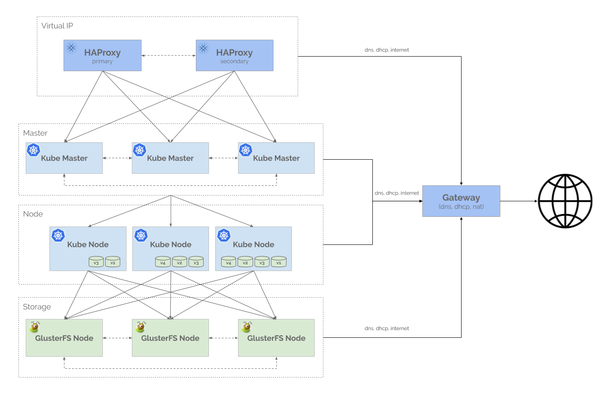

## Architecture Overview

## HAProxy cluster

High Availability HAProxy load balancer, with the support of a Floating IP and the Corosync/Pacemaker cluster stack. The HAProxy load balancers will each be configured to split traffic between two backend application servers. If the primary load balancer goes down, the Floating IP will be moved to the second load balancer automatically, allowing service to resume.
> Reference: https://www.digitalocean.com/community/tutorials/how-to-create-a-high-availability-haproxy-setup-with-corosync-pacemaker-and-floating-ips-on-ubuntu-14-04

## Kubernetes cluster

**Kubernetes coordinates a highly available cluster of computers that are connected to work as a single unit.** The abstractions in Kubernetes allow you to deploy containerized applications to a cluster without tying them specifically to individual machines. To make use of this new model of deployment, applications need to be packaged in a way that decouples them from individual hosts: they need to be containerized. Containerized applications are more flexible and available than in past deployment models, where applications were installed directly onto specific machines as packages deeply integrated into the host. **Kubernetes automates the distribution and scheduling of application containers across a cluster in a more efficient way.** 

Kubernetes is an open-source platform and is production-ready.
> Reference: https://kubernetes.io/docs/tutorials/kubernetes-basics/create-cluster/cluster-intro/

## Gluster
GlusterFS is a scalable network filesystem suitable for data-intensive tasks such as cloud storage and media streaming. GlusterFS is free and open source software and can utilize common off-the-shelf hardware.
> Reference: https://docs.gluster.org/en/latest/Administrator%20Guide/GlusterFS%20Introduction/

## Cluster
Cluster is an English term meaning "agglomerate" or "agglomeration" and can be applied in various contexts. In the case of computing, the term defines a system architecture capable of combining several computers to work together.

Each station is called a "node" and, in combination, forms the cluster. In some cases, it is possible to see references such as "supercomputers" or "cluster computing" for the same scenario, representing the hardware used or the software specially developed to be able to combine these equipments.
> Reference: https://en.wikipedia.org/wiki/Computer_cluster

### How are clusters formed?
It may seem very simple to aggregate multiple computers together to perform tasks, but it is not. Efforts to efficiently build this kind of use began at IBM in 1960 and are under constant renovation. The objective is always to increase the efficiency of the fusion, that is, to optimize the full use of the resources of all the stations and to evolve in the dynamicity of the circuit.

### Are all clusters the same?
No. There are different types of supercomputers that are focused on different benefits of merging and hence are more suitable for certain tasks and markets. See below the four main types of clusters:

#### Failover or High Availability (HA)
As its name suggests, these clusters are developed with the main focus being on maintaining the ever active network. Regardless of what happens at each node, it is essential that the system remain online. For this, several stations work on a system of redundancy invisible to the user. Almost as if, in a basketball game, a player who has exactly the same characteristics as the holder - practically a clone of the original - was always warm and standing on the edge of the court. If the principal needs to leave, immediately the other takes action, without the judge, the cheer or the team mates realizing. This is a type of cluster commonly used in services such as e-mail, which can not get out of the air at all.

#### Load Balancing
In this type of architecture, all nodes are responsible for running tasks. Whether the traffic of incoming requests or resource requests (more memory for storing data, for example) are distributed to the machines that make up the system. It's literally a "all by one". From the simplest to the most complex task demanded is accomplished with the strength resulting from the union of available resources. In this model, performance is prioritized and, if one of the stations fails, it is removed from the system and the task is redistributed among the others. Companies that use server towers (webfarm) use this type of cluster.

#### Combined Models
In some cases, it is not possible to prioritize performance over stability or vice versa. MTA servers or e-mails, for example, need both features with equivalent efficiency. Therefore, these companies use a combined load-balancing and high-availability cluster. In an integrated way, the system is able to join resources of the different machines while having an internal network of redundancy to avoid falls.

#### Parallel Processing
In this type of cluster, large tasks are divided into less complex activities, distributed by the system and executed in parallel by the various nodes of the cluster. Therefore, the most efficient applicability of this kind is in the case of very complex computational tasks. Roughly speaking, it would be like splitting a jigsaw puzzle of five thousand pieces into ten friends, and in that situation, each node is responsible for assembling a part of five hundred pieces. With everything assembled, just put together.

Supercomputers are a reliable way to process a large amount of data.