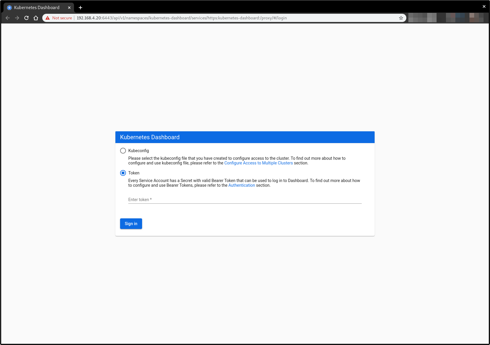
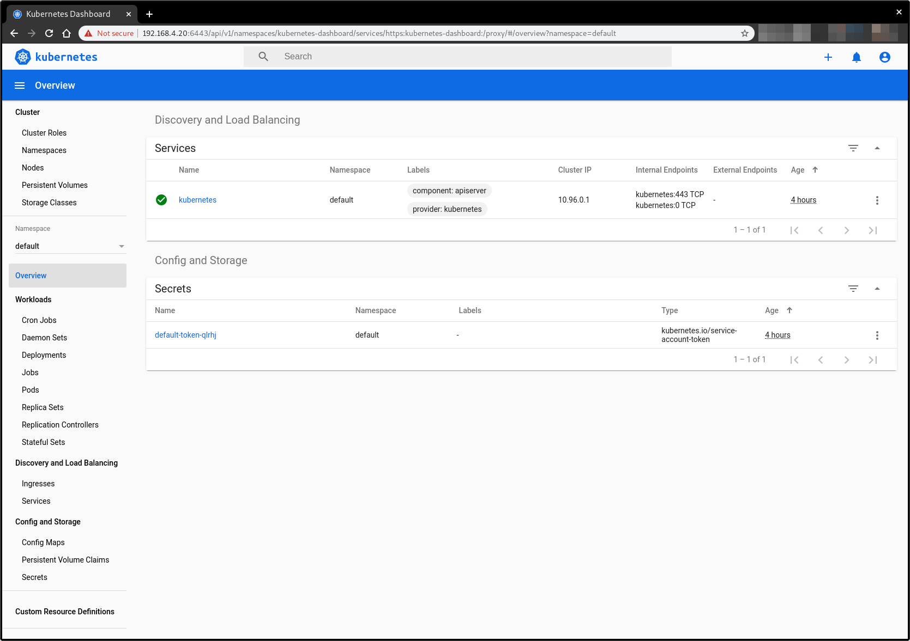

## Kubernetes Dashboard
Dashboard is a web-based Kubernetes user interface. You can use Dashboard to deploy containerized applications to a Kubernetes cluster, troubleshoot your containerized application, and manage the cluster resources. You can use Dashboard to get an overview of applications running on your cluster, as well as for creating or modifying individual Kubernetes resources (such as Deployments, Jobs, DaemonSets, etc). For example, you can scale a Deployment, initiate a rolling update, restart a pod or deploy new applications using a deploy wizard.

Dashboard also provides information on the state of Kubernetes resources in your cluster and on any errors that may have occurred.

<p align="center">
  
</p>

### Deploy

1. Create the dashboard from the `kubernetes-dashboard.yaml` file:
   ```
   ssh debian@kube-mast01.kube.local
   
   sudo su -
   
   kubectl create -f https://raw.githubusercontent.com/kubernetes/dashboard/master/aio/deploy/recommended/kubernetes-dashboard.yaml
   ```
   
   The response should look similar to this:
   ```
   secret/kubernetes-dashboard-certs created
   secret/kubernetes-dashboard-csrf created
   serviceaccount/kubernetes-dashboard created
   role.rbac.authorization.k8s.io/kubernetes-dashboard-minimal created
   rolebinding.rbac.authorization.k8s.io/kubernetes-dashboard-minimal created
   deployment.apps/kubernetes-dashboard created
   service/kubernetes-dashboard created
   ```

2. Checking the state of pods after dashboard deployed
   ```
   kubectl get pods -o wide -n kube-system
   ```
   
   The response should look similar to this:
   ```
   NAME                                   READY   STATUS    RESTARTS   AGE    IP              NODE          NOMINATED NODE   READINESS GATES
   coredns-86c58d9df4-6gzrk               1/1     Running   0          171m   10.244.0.4      kube-mast01   <none>           <none>
   coredns-86c58d9df4-fxj5r               1/1     Running   0          171m   10.244.0.5      kube-mast01   <none>           <none>
   etcd-kube-mast01                       1/1     Running   0          170m   192.168.1.72    kube-mast01   <none>           <none>
   etcd-kube-mast02                       1/1     Running   0          141m   192.168.1.68    kube-mast02   <none>           <none>
   etcd-kube-mast03                       1/1     Running   0          140m   192.168.1.81    kube-mast03   <none>           <none>
   kube-apiserver-kube-mast01             1/1     Running   0          170m   192.168.1.72    kube-mast01   <none>           <none>
   kube-apiserver-kube-mast02             1/1     Running   1          141m   192.168.1.68    kube-mast02   <none>           <none>
   kube-apiserver-kube-mast03             1/1     Running   0          139m   192.168.1.81    kube-mast03   <none>           <none>
   kube-controller-manager-kube-mast01    1/1     Running   1          170m   192.168.1.72    kube-mast01   <none>           <none>
   kube-controller-manager-kube-mast02    1/1     Running   1          141m   192.168.1.68    kube-mast02   <none>           <none>
   kube-controller-manager-kube-mast03    1/1     Running   0          140m   192.168.1.81    kube-mast03   <none>           <none>
   kube-flannel-ds-amd64-4dmxn            1/1     Running   0          11m    192.168.2.188   kube-node02   <none>           <none>
   kube-flannel-ds-amd64-545vl            1/1     Running   0          165m   192.168.1.72    kube-mast01   <none>           <none>
   kube-flannel-ds-amd64-gnngz            1/1     Running   0          140m   192.168.1.81    kube-mast03   <none>           <none>
   kube-flannel-ds-amd64-lqfqp            1/1     Running   0          10m    192.168.2.144   kube-node03   <none>           <none>
   kube-flannel-ds-amd64-trxc2            1/1     Running   0          141m   192.168.1.68    kube-mast02   <none>           <none>
   kube-flannel-ds-amd64-zhd6c            1/1     Running   0          11m    192.168.2.185   kube-node01   <none>           <none>
   kube-proxy-2zvvb                       1/1     Running   0          11m    192.168.2.185   kube-node01   <none>           <none>
   kube-proxy-8kb86                       1/1     Running   0          171m   192.168.1.72    kube-mast01   <none>           <none>
   kube-proxy-9blvj                       1/1     Running   0          11m    192.168.2.188   kube-node02   <none>           <none>
   kube-proxy-cpspc                       1/1     Running   0          140m   192.168.1.81    kube-mast03   <none>           <none>
   kube-proxy-hmqpn                       1/1     Running   0          10m    192.168.2.144   kube-node03   <none>           <none>
   kube-proxy-j6sch                       1/1     Running   0          141m   192.168.1.68    kube-mast02   <none>           <none>
   kube-scheduler-kube-mast01             1/1     Running   1          170m   192.168.1.72    kube-mast01   <none>           <none>
   kube-scheduler-kube-mast02             1/1     Running   0          141m   192.168.1.68    kube-mast02   <none>           <none>
   kube-scheduler-kube-mast03             1/1     Running   0          140m   192.168.1.81    kube-mast03   <none>           <none>
   kubernetes-dashboard-57df4db6b-pcwn2   1/1     Running   0          75s    10.244.3.2      kube-node01   <none>           <none>
   ```
   
   > Now you can see the dashboard pod `kubernetes-dashboard-57df4db6b-pcwn2`

### Configure

#### `serviceaccount`

We need service account to access K8S Dashboard

1. Create service account
   ```
   kubectl create serviceaccount cluster-admin-dashboard -n kube-system
   
   kubectl create clusterrolebinding cluster-admin-dashboard \
       --clusterrole=cluster-admin \
       --serviceaccount=kube-system:cluster-admin-dashboard \
       -n kube-system
   ```

   The responses should look similar to this:
   ```
   serviceaccount/cluster-admin-dashboard created
   ```
   ```
   clusterrolebinding.rbac.authorization.k8s.io/cluster-admin-dashboard created
   ```

### View Dashboard

#### Bearer Token

We need get token of service account `cluster-admin-dashboard`

1. Query secrets
   ```
   kubectl get secret -n kube-system
   ```
   
   The response should look similar to this:
   ```
   NAME                                             TYPE                                  DATA   AGE
   attachdetach-controller-token-m9c6n              kubernetes.io/service-account-token   3      179m
   bootstrap-signer-token-x6zb2                     kubernetes.io/service-account-token   3      179m
   bootstrap-token-o8qma9                           bootstrap.kubernetes.io/token         6      179m
   bootstrap-token-y5uii4                           bootstrap.kubernetes.io/token         6      153m
   certificate-controller-token-fc9jv               kubernetes.io/service-account-token   3      179m
   cluster-admin-dashboard-token-q89fp              kubernetes.io/service-account-token   3      3m21s
   clusterrole-aggregation-controller-token-bxc8k   kubernetes.io/service-account-token   3      179m
   coredns-token-rpvwt                              kubernetes.io/service-account-token   3      179m
   cronjob-controller-token-bmmkm                   kubernetes.io/service-account-token   3      179m
   daemon-set-controller-token-ntjmx                kubernetes.io/service-account-token   3      179m
   default-token-xh9s2                              kubernetes.io/service-account-token   3      179m
   deployment-controller-token-vdfh6                kubernetes.io/service-account-token   3      179m
   disruption-controller-token-qr2q9                kubernetes.io/service-account-token   3      179m
   endpoint-controller-token-6nhjc                  kubernetes.io/service-account-token   3      179m
   expand-controller-token-fpcpk                    kubernetes.io/service-account-token   3      179m
   flannel-token-vrqmt                              kubernetes.io/service-account-token   3      173m
   generic-garbage-collector-token-mfz56            kubernetes.io/service-account-token   3      179m
   horizontal-pod-autoscaler-token-r2v2h            kubernetes.io/service-account-token   3      179m
   job-controller-token-d8q6h                       kubernetes.io/service-account-token   3      179m
   kube-proxy-token-789vw                           kubernetes.io/service-account-token   3      179m
   kubernetes-dashboard-certs                       Opaque                                0      9m11s
   kubernetes-dashboard-csrf                        Opaque                                1      9m11s
   kubernetes-dashboard-key-holder                  Opaque                                2      9m1s
   kubernetes-dashboard-token-jgs6k                 kubernetes.io/service-account-token   3      9m11s
   namespace-controller-token-tf6vw                 kubernetes.io/service-account-token   3      179m
   node-controller-token-wfrbl                      kubernetes.io/service-account-token   3      179m
   persistent-volume-binder-token-64sqb             kubernetes.io/service-account-token   3      179m
   pod-garbage-collector-token-hdh2v                kubernetes.io/service-account-token   3      179m
   pv-protection-controller-token-h2vn8             kubernetes.io/service-account-token   3      179m
   pvc-protection-controller-token-hfkcx            kubernetes.io/service-account-token   3      179m
   replicaset-controller-token-49tr6                kubernetes.io/service-account-token   3      179m
   replication-controller-token-rbzfj               kubernetes.io/service-account-token   3      179m
   resourcequota-controller-token-7r6ql             kubernetes.io/service-account-token   3      179m
   service-account-controller-token-t89b9           kubernetes.io/service-account-token   3      179m
   service-controller-token-j6jt2                   kubernetes.io/service-account-token   3      179m
   statefulset-controller-token-g7bpf               kubernetes.io/service-account-token   3      179m
   token-cleaner-token-tzdh2                        kubernetes.io/service-account-token   3      179m
   ttl-controller-token-q5p9n                       kubernetes.io/service-account-token   3      179m
   ```
   
   > Now you can see the service account token of `cluster-admin-dashboard` with name `cluster-admin-dashboard-token-q89fp`

2. Get token we describe `cluster-admin-dashboard-token-q89fp`
   ```
   kubectl describe secret cluster-admin-dashboard-token-q89fp -n kube-system
   ```
   
   The response should look similar to this:
   ```
   Name:         cluster-admin-dashboard-token-q89fp
   Namespace:    kube-system
   Labels:       <none>
   Annotations:  kubernetes.io/service-account.name: cluster-admin-dashboard
                 kubernetes.io/service-account.uid: 5e76dfe8-698d-11e9-8ce8-0800276f613b
   
   Type:  kubernetes.io/service-account-token
   
   Data
   ====
   ca.crt:     1025 bytes
   namespace:  11 bytes
   token:         eyJhbGciOiJSUzI1NiIsImtpZCI6IiJ9.eyJpc3MiOiJrdWJlcm5ldGVzL3NlcnZpY2VhY2NvdW50Iiwia3ViZXJuZXRlcy5pby9zZXJ2aWNlYWNjb3VudC9uYW1lc3BhY2UiOiJrdWJlLXN5c3RlbSIsImt1YmVybmV0ZXMuaW8vc2VydmljZWFjY291bnQvc2VjcmV0Lm5hbWUiOiJjbHVzdGVy   LWFkbWluLWRhc2hib2FyZC10b2tlbi1xODlmcCIsImt1YmVybmV0ZXMuaW8vc2VydmljZWFjY291bnQvc2VydmljZS1hY2NvdW50Lm5hbWUiOiJjbHVzdGVyLWFkbWluLWRhc2hib2FyZCIsImt1YmVybmV0ZXMuaW8vc2VydmljZWFjY291bnQvc2VydmljZS1hY2NvdW50LnVpZCI6IjVlNzZkZmU4LTY5OGQtMTFlOS04Y2U4LTA4MDAyNzZmNjEzYiIsInN1YiI6InN5c3RlbTpzZXJ2aWNlYWNjb3VudDprdWJlLXN5c3RlbTpjbHVzdGVyLWFkbWluLWRhc2hib2FyZCJ9.QQ8YLxtkx5dotSI5Yo7xKrpdKpw9bTba_LYvkdYobe_UW8Gg2ldp6j1FUMXTK63_TTehl3QMjyGm7o0nnvycLrkbXtIhL72m6dDNr6bMgRKdIDScAtU9KOk05EPXbHmnCRuEdqJlA24vlgGc7-14lTCVt5O7-dwTvisPaX0pZJkkVk90X5EBsoY3wITtIrNiGpnXW8eQINWzxVk4Tmhq8UQbibOo-0C77dh0joWEnIN7ToKBp3fIwqp8-UvyUMvsDEhio12fWngvwjxssOpRg1a_AuH_Ib6yOa-E13s97vo-SHgDFTnhEPP5EVSbxBx75bOzbGIatNuSGNRg-UFHcQ
   ```
   > We are going to use token `eyJhbGciOiJSUzI1NiIsImtpZCI6IiJ9....SHgDFTnhEPP5EVSbxBx75bOzbGIatNuSGNRg-UFHcQ` (I show here first and last blocks, but you must use the full printed value)

#### `kube proxy`

Now we need configure kubectl in your local station.

1. Copy config from master node
   ```
   mkdir ~/.kube
   
   ssh debian@kube-mast01.kube.local 'sudo cat /root/.kube/config' > ~/.kube/config
   ```

2. Start `kubectl proxy`
   ```
   kubectl proxy
   ```

3. To view dashboard ui open your browser with address [http://localhost:8001/api/v1/namespaces/kube-system/services/https:kubernetes-dashboard:/proxy/](http://localhost:8001/api/v1/namespaces/kube-system/services/https:kubernetes-dashboard:/proxy/)

4. Now copy the token and paste it into Enter token field on log in screen.
   

5. Click Sign in button and that's it. You are now logged in as an admin.
   
